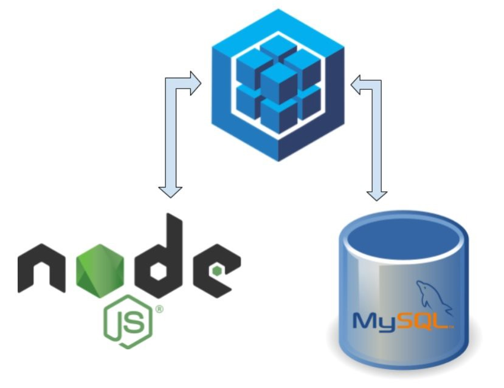

## Projeto de uma Aplicação(API) Back-End (CRUD) - seguindo as métricas de engenharia de software (MSC):

### o que é uma API?
> Uma API é um conjunto de rotinas, protocolos e ferramentas para construir aplicações.
> [Fonte: Stack OverFlow ](https://pt.stackoverflow.com/questions/86399/qual-a-diferen%C3%A7a-entre-endpoint-e-api);


### O que um CRUD?
> Nas manipulações de registros realizadas diretamente em banco de dados ou em plataformas
> desenvolvidas no padrão RESTful, o conceito CRUD estabelece o modelo correto no manuseio
> desses dados.
> CRUD representa as quatro principais operações realizadas em banco de dados, seja no modelo 
> relacional (SQL) ou não-relacional (NoSQL), facilitando no processamento dos dados e na 
> consistência e integridade das informações.  
> [Fonte de Informação: Blog byTrybe ](https://blog.betrybe.com/tecnologia/crud-operacoes-basicas/);


### 1 - Setup inicial da aplicação:

- [x] Criando uma Pastas CrudeNode;

```console
mkdir CrudNode
```

- [x] - Entrando na pasta;

```console
cd CrudNode
```
- [x] - Criar um arquivo README.md;

```console
touch README.md
```

- [x] - criar uma arquivo .gitignore e colocar corpo do arquivo node_modules como pasta a ser ignorada 

```console
touch .gitignore
```
> Dentro do Arquivo no corpo colocar: node_modules/

- [x] - Executar o comando de inicialização do git localmente na pasta;

```console
git init
```

- [x] - Criar um repositório remoto no github;
  
```text
tonistorres/CrudNodePinar
``` 
- [x] - Lincar o Repositório remoto ao repositório local; 

```text
git remote add origin git@github.com:tonistorres/CrudNodePinar.git
```

- [x] - instalar o "git-commit-msg-linter": "^4.1.1";

```console
npm i git-commit-msg-linter -D
```
> Observacão: Significado das tags relacionadas ao commit-msg-linter

```console
type:
    feat     Adição de funcionalidade.
    fix      Correção de defeito.
    docs     Mudança em documentação.
    style    Mudança de formatação ou estilo, que não afeta a execução do código (espaço, tabulação, etc).
    refactor Mudança na organização do código, que não afeta o comportamento existente.
    test     Adição ou mudança de um teste.
    chore    Adição ou mudança em script de build, que não afeta o código de produção.
    perf     Mudança de código para melhoria de desempenho.
    ci       Mudança de configuração de integração contínua.
    build    Mudança em arquivos de build ou em dependências externas.
    temp     Commit temporário, que não deve ser incluído no CHANGELOG.

  scope:
    Opcional, pode ser qualquer coisa que especifique o escopo da mudança.
    Exemplos: subpacote, workspace, módulo, componente, página.

  subject:
    Breve resumo da mudança, escrito no tempo verbal presente. Começa com letra minúscula e não há ponto final.
```

- [x] - Criar uma branch tonis-torres-crud-node;

```console
git checkout -b tonis-torres-crud-node;
```
> Alguns comandos git util no desenvolvimento:

```console
git status
git add .
git commit -m""
git push
git push -u origin nome_branch
git pull
git log 
git log --oneline
git tag "nome_tag" -m"" 
git tag -a "nome_tag" -m"" id
```


### 2 - Ferramentas e pacotes que utilizaremos no desenvolvimento da aplicação:

- [x] - FrameWork Express ;
- [x] - nodemom;
- [x] - Mysql;
- [x] - MySQL Workbench (Ferramenta Gráfica);
- [x] - Client que faz a conexão do Node com o Mysql (msql2); 
- [x] - body-parse;
- [x] - mocha ^9.2.2;
- [x] - chai: ^4.3.6; 
- [x] - sinon: ^13.0.1
  

### 3 - Comandos utilizados na instalação:

- [x] - npm install -D nodemon mocha chai sinon;
- [Link Pacote npm Nodemon ](https://duckduckgo.com)
- [Link pacote npm Chai](https://www.npmjs.com/package/chai)
- [Link pacote npm Mocha](https://www.npmjs.com/package/mocha)
- [Link Pacote npm Sinon](https://www.npmjs.com/package/sinon)
  > Obs.: O D MAIÚSCULO é informa que é uma forma contraída de dizer que é uma Dependência de 
  > Desenvolvimento, ou seja, na hora de subir para a produção essa dependência não tem importancia para 
  > o bom funcionamento da minha aplicação, essa dependencia é somente para testes no momento do 
  > desenvolvimento.
 
- [x] - npm i express;
- [Link Express ](https://www.npmjs.com/package/express)
 
- [x] - npm install --save mysql2
 > Client Utilizado para fazer a conexão de uma palicação Node Com Mysql (connector);
 
- [x] - npm i body-parser
  > Middleware de análise do corpo do Node.js.
  > Analise os corpos de solicitação de entrada em um middleware antes de seus manipuladores,
  > disponíveis na propriedade req.body.
- [Body-Parse](https://www.npmjs.com/package/body-parser)

- [x] - npm i http-status-codes (OPCIONAL)
  > códigos de status http constantes enumerando os códigos de status HTTP.
  > Baseado na API Java Apache HttpStatus.
  - [status-codes](https://www.npmjs.com/package/http-status-codes)
  - 
### 4- Sobre os  END-POINTS:

#### 4.1 - O que é um End-Point?
> Um endpoint de um web service é a URL onde seu serviço pode ser acessado por uma aplicação cliente. 
> [Fonte: Stack OverFlow ](https://pt.stackoverflow.com/questions/86399/qual-a-diferen%C3%A7a-entre-endpoint-e-api);

##### 4.1.1 - End-Point create:
> Nesta Api o End-Point create foi distribuído em 03(três) camadas (Controller, Service e Model), onde
> utilizamos conceitos e abstraçẽos de engenharia de software para isolar a lógica de responsábilidades
> em suas respectivas camadas. A principal funcionalidade desse end-point é criar um usuário novo dentro
> do banco de dados inovec87_sisseg com ajuda do gerenciador de banco de dados mysql e um client que é um
> paconte npm mysql2 para fazer a comunicação entre a aplicação node e o mysql. Abaixo segue uma breve
> descrição de como foi escrito e dividido o código por meio de um gif animator.


##### 4.1.2 End-Point delete:
> O End-Point delete foi distribuído em 03(três) camadas (Controller, Service e Model), 
> sua funcionalidade consiste em apagar do banco de dados um registro específico mediante
> requisição passada pela url (req.params).


##### 4.1.2 End-Point getAll (buscar por todos registros):
> O End-Point getAll foi distribuído em 03(três) camadas (Controller, Service e Model), 
> sua funcionalidade consiste em buscar todos os registros do banco de dados mediante
> requisição passada pela url (req).


##### 4.1.3 End-Point getById (buscar um registros específico):
> O End-Point getById foi distribuído em 03(três) camadas (Controller, Service e Model), 
> sua funcionalidade consiste em buscar no banco de dados um usuário específico mediante
> requisição passsada por url (req.params).


##### 4.1.4 End-Point getUpdate (Alterar um Registro Específico):
> O End-Point getUpdate foi distribuído em 03(três) camadas (Controller, Service e Model), 
> sua funcionalidade consiste em fazer atualização das informaçẽos do usuário mediante, 
> mediante requisição enviada pelo (req.body).


##### 4.1.5 End-Point getLogin (Verificar solicitação usuário):
> O End-Point getLogin foi distribuído em 03(três) camadas (Controller, Service e Model), 
> sua funcionalidade em fazer uma verificação no DB, se usuário e senha foram inputados de forma
> satisfatória, então, será gerado um token de autenticação com a validade de 15minutos para ter
> acesso às rotas que o usuário precisa de autorização.


### ADICIONANDO UMA CAMADA DE SEGURANÇA NA APLICAÇÃO COM JSON WEB TOKEN (JWT):


##### O QUE É JWT? 

> Json Web Token, é um padrão para autenticação e troca de informações, definido pela RFC7519. De forma bastante
> resumida, consiste em um conjunto de solicitações. O JWT se faz essencial por ser uma forma extremamente segura
> de compartilhamento de informações e autenticação de usuários. É um formato baseado em texto e amplamente aceito 
> por diversas linguagens, característica que carrega por utilizar JSON como base.

> Esse é o grande diferencial do JWT em relação a outras opções, pois o JSON é um padrão mais vantajoso de troca e
> armazenamento de informação. Alguns dos concorrentes são o SWT (Simple Web Tokens) e o SAML (Security Assertion 
> Markup Language Tokens), que usa o padrão XML.

> O JWT é, na verdade, um dos elementos de uma estrutura ainda maior, o JOSE (Json Object Signing and Encryption). 
> No JOSE, estão contidas várias outras especificações. São elas: o JWE (Json Web Encryption), responsável pela 
> criptografia para a assinatura do token; o JWA (Json Web Algorithms), a respeito do algoritmo; JWK (Json Web Keys)
> , correspondente as chaves para assinatura; JWS (Json Web Signature), a assinatura do token. Por fim, o JWT, 
> elemento JOSE, é o token em si
> [Fonte: Blog Trybe ](https://blog.betrybe.com/tecnologia/jwt-json-web-tokens/);


### Configurando ambiente para receber JWT:

- [x] - Primeiro iremos instalar o pacote npm jsonwebtoken;

```console 
npm install jsonwebtoken
```
- [x] - Instalando dotenv para trabalharmos com vaiáveis de ambiente;

```console 
npm i dotenv
```

### Adicionando ORM Sequelize ao Projeto 


#### O que é ORM?

> O Sequelize é um ORM (Object-Relational Mapper)
> para Node.js, que tem suporte aos bancos de dados
> PostgreSQL, MariaDB, MySQL, SQLite e MSSQL, como 
> ORM ele faz o mapeamento de dados relacionais 
> (tabelas, colunas e linhas) para objetos 
> Javascript.

[Fonte: Blog Rocketseat ](https://blog.rocketseat.com.br/nodejs-express-sequelize/);

#### Preparando o ambiente para instalação do Sequelize:

1 - instalação do ORM sequelize

```console
npm install sequelize   
```

2- instalar um cliente responsável por gerar e executar operações 

```console
npm install sequelize-cli
```

3- instalar o mysql2 necessário para fazer a conexão entre o MYSQL e Node

```console
npm install mysql2
```

## Iniciando os trabalhos com Sequelize 

1 - iniciando um projeto com Sequelize
[x] npx sequelize-cli init

```console
Esse comando irá criar as seguintes pastas:
config : contém um arquivo de configuração, com orientações para o CLI se conectar com o nosso banco de dados;
models : contém todos os modelos da nossa aplicação;
migrations : contém todos os arquivos de migração da nossa aplicação;
seeders : contém todos os arquivos de "seeds" (sementes que são usadas para popular o banco).
```
2 - vamos instalar a biblioteca dotenv para trabalharmos com variáveis de ambiente 
[x] - npm i dotenv

3 - agora iremos criar arquivo .gitignore e definiar que não iremos subir para o github o .env e node_modules/  
[x] .gitignore

4 - Entrar no arquivo config.json e configurar as chaves que fazer acesso ao seu banco de dados mysql

```console
{
  "development": {
    "username": "root",
    "password": "",
    "database": "orm_example",
    "host": "127.0.0.1",
    "dialect": "mysql"
  }

```

> OBSERVAÇÃO: adicionar o a pasta config/config.json ao .gitignore para que informações sensívei não subam para o 
> github.


5 - Criando o banco de dados já predefinido no arquivo config.json 
[x] - npx sequelize db:create

```console
Loaded configuration file "config/config.json".
Using environment "development".
Database dbuser created.
```

6 - verirfique no seu CLI Mysql se o banco foi criado

```console

Execute o comando no terminal:
mysql -u root -p

coloque sua senha de acesso ao mysql: 
passord: xxxx

Dentro do banco execute  o comando abaixo para listar todas db:
show databases;

```

7 - Criando uma tabela User dentro de (model) com um atributo por nome fullName e 
uma migration com uma copia da tabela criada:

```console
npx sequelize model:generate --name User --attributes fullName:string
```
#### Observação:
> O arquivo user.js criado na pasta (model) está mapeando a tabela utilizando classe,
> ou seja, usando POO (Paradigma da Orientação Objeto), porém, nesse momento estamos 
> usando programação funcioal daí iremo converter todo conteúdo criando em classe para 
> função.

8 - Para executarmos um migrations de forma ela executar uma operação no banco de dados 
utilizamos o CLI Sequelize instalados com o abaixo explicitado que ela irá fazer alterações 
na tabela do banco de dados setando no arquivo config.json

```console 
    npx sequelize db:migrate
```

9 - Caso queira reverter uma migrations utilize o comando abaixo: 

```console 
npx sequelize db:migrate:undo
```

10 - Criar uma migrations para adicionarmos um campo numa tabel já criada:

```console 
npx sequelize migration:generate --name add-column-phone-table-users
```
##### O corpo da migrations ficará da seguinte forma:

```javascript 

'use strict';

module.exports = {
  up: async (queryInterface, Sequelize) => {
    await queryInterface.addColumn('Users', 'phone_num', {
      type: Sequelize.STRING,
    });
   },
 
   down: async (queryInterface, Sequelize) => {
     await queryInterface.removeColumn('Users', 'phone_num');
   }
};

```

