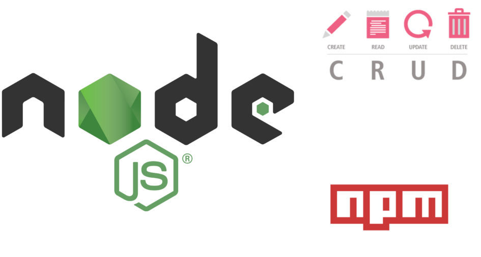
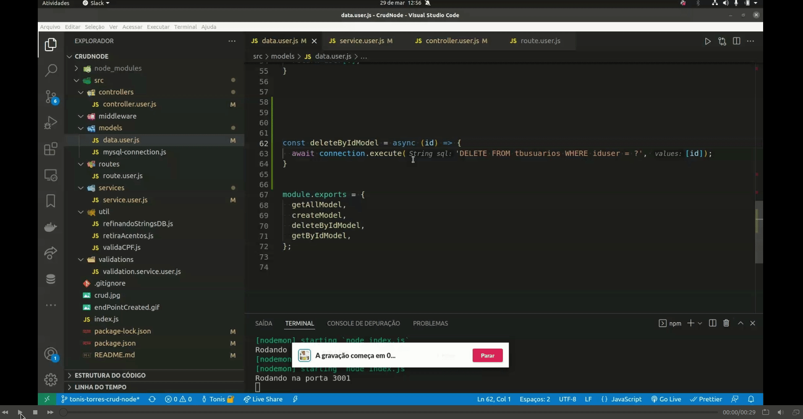

## Projeto de uma Aplicação(API) Back-End (CRUD) - seguindo as métricas de engenharia de software:

### o que é uma API?
> Uma API é um conjunto de rotinas, protocolos e ferramentas para construir aplicações.
> [Fonte: Stack OverFlow ](https://pt.stackoverflow.com/questions/86399/qual-a-diferen%C3%A7a-entre-endpoint-e-api);


### O que um CRUD?
> Nas manipulações de registros realizadas diretamente em banco de dados ou em plataformas
> desenvolvidas no padrão RESTful, o conceito CRUD estabelece o modelo correto no manuseio
> desses dados.
> CRUD representa as quatro principais operações realizadas em banco de dados, seja no modelo 
> relacional (SQL) ou não-relacional (NoSQL), facilitando no processamento dos dados e na 
> consistência e integridade das informações.  
> [Fonte de Informação: Blog byTrybe ](https://blog.betrybe.com/tecnologia/crud-operacoes-basicas/);


### 1 - Setup inicial da aplicação:

- [x] Criando uma Pastas CrudeNode;

```console
mkdir CrudNode
```

- [x] - Entrando na pasta;

```console
cd CrudNode
```
- [x] - Criar um arquivo README.md;

```console
touch README.md
```

- [x] - criar uma arquivo .gitignore e colocar corpo do arquivo node_modules como pasta a ser ignorada 

```console
touch .gitignore
```
> Dentro do Arquivo no corpo colocar: node_modules/

- [x] - Executar o comando de inicialização do git localmente na pasta;

```console
git init
```

- [x] - Criar um repositório remoto no github;
  
```text
tonistorres/CrudNodePinar
``` 
- [x] - Lincar o Repositório remoto ao repositório local; 

```text
git remote add origin git@github.com:tonistorres/CrudNodePinar.git
```

- [x] - instalar o "git-commit-msg-linter": "^4.1.1";

```console
npm i git-commit-msg-linter -D
```
> Observacão: Significado das tags relacionadas ao commit-msg-linter

```console
type:
    feat     Adição de funcionalidade.
    fix      Correção de defeito.
    docs     Mudança em documentação.
    style    Mudança de formatação ou estilo, que não afeta a execução do código (espaço, tabulação, etc).
    refactor Mudança na organização do código, que não afeta o comportamento existente.
    test     Adição ou mudança de um teste.
    chore    Adição ou mudança em script de build, que não afeta o código de produção.
    perf     Mudança de código para melhoria de desempenho.
    ci       Mudança de configuração de integração contínua.
    build    Mudança em arquivos de build ou em dependências externas.
    temp     Commit temporário, que não deve ser incluído no CHANGELOG.

  scope:
    Opcional, pode ser qualquer coisa que especifique o escopo da mudança.
    Exemplos: subpacote, workspace, módulo, componente, página.

  subject:
    Breve resumo da mudança, escrito no tempo verbal presente. Começa com letra minúscula e não há ponto final.
```

- [x] - Criar uma branch tonis-torres-crud-node;

```console
git checkout -b tonis-torres-crud-node;
```
> Alguns comandos git util no desenvolvimento:

```console
git status
git add .
git commit -m""
git push
git push -u origin nome_branch
git pull
git log 
git log --oneline
git tag "nome_tag" -m"" 
git tag -a "nome_tag" -m"" id
```


### 2 - Ferramentas e pacotes que utilizaremos no desenvolvimento da aplicação:

- [x] - FrameWork Express ;
- [x] - nodemom;
- [x] - Mysql;
- [x] - MySQL Workbench (Ferramenta Gráfica);
- [x] - Client que faz a conexão do Node com o Mysql (msql2); 
- [x] - body-parse;
- [x] - mocha ^9.2.2;
- [x] - chai: ^4.3.6; 
- [x] - sinon: ^13.0.1

### 3 - Comandos utilizados na instalação:

- [x] - npm install -D nodemon mocha chai sinon;
- [Link Pacote npm Nodemon ](https://duckduckgo.com)
- [Link pacote npm Chai](https://www.npmjs.com/package/chai)
- [Link pacote npm Mocha](https://www.npmjs.com/package/mocha)
- [Link Pacote npm Sinon](https://www.npmjs.com/package/sinon)
  > Obs.: O D MAIÚSCULO é informa que é uma forma contraída de dizer que é uma Dependência de 
  > Desenvolvimento, ou seja, na hora de subir para a produção essa dependência não tem importancia para 
  > o bom funcionamento da minha aplicação, essa dependencia é somente para testes no momento do 
  > desenvolvimento.
 
- [x] - npm i express;
- [Link Express ](https://www.npmjs.com/package/express)
 
- [x] - npm install --save mysql2
 > Client Utilizado para fazer a conexão de uma palicação Node Com Mysql (connector);
 
- [x] - npm i body-parser
  > Middleware de análise do corpo do Node.js.
  > Analise os corpos de solicitação de entrada em um middleware antes de seus manipuladores,
  > disponíveis na propriedade req.body.
- [Body-Parse](https://www.npmjs.com/package/body-parser)

- [x] - npm i http-status-codes (OPCIONAL)
  > códigos de status http constantes enumerando os códigos de status HTTP.
  > Baseado na API Java Apache HttpStatus.
  - [status-codes](https://www.npmjs.com/package/http-status-codes)
  - 
### 4- Sobre os  END-POINTS:

#### 4.1 - O que é um End-Point?
> Um endpoint de um web service é a URL onde seu serviço pode ser acessado por uma aplicação cliente. 
> [Fonte: Stack OverFlow ](https://pt.stackoverflow.com/questions/86399/qual-a-diferen%C3%A7a-entre-endpoint-e-api);

##### 4.1.1 - End-Point create:
> Nesta Api o End-Point create foi distribuído em 03(três) camadas (Controller, Service e Model), onde
> utilizamos conceitos e abstraçẽos de engenharia de software para isolar a lógica de responsábilidades
> em suas respectivas camadas. A principal funcionalidade desse end-point é criar um usuário novo dentro
> do banco de dados inovec87_sisseg com ajuda do gerenciador de banco de dados mysql e um client que é um
> paconte npm mysql2 para fazer a comunicação entre a aplicação node e o mysql. Abaixo segue uma breve
> descrição de como foi escrito e dividido o código por meio de um gif animator.


##### 4.1.2 End-Point delete:
> O End-Point delete foi distribuído em 03(três) camadas (Controller, Service e Model), 
> seguindo as mesmas diretrizes e responsabilidades do end-point create acima explicitado.




##### 4.1.2 End-Point getAll (buscar por todos registros):
> O End-Point getAll foi distribuído em 03(três) camadas (Controller, Service e Model), 
> seguindo as mesmas métricas acima explicitadas.


##### 4.1.3 End-Point getById (buscar um registros específico):
> O End-Point getById foi distribuído em 03(três) camadas (Controller, Service e Model), 
> seguindo as mesmas métricas acima explicitadas.

![END-POINT CREATE](./getById.